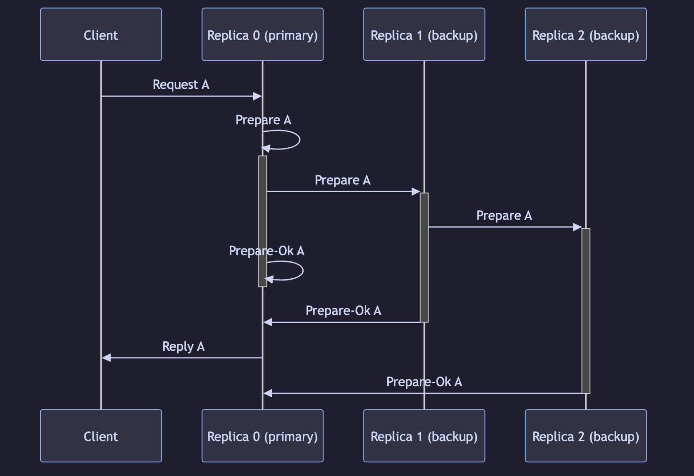

<!-- _class: lead -->

# Exploring TigerBeetle, part 2

## Viewstamped Replication (VSR) Consensus Protocol

### Part of the ongoing Designing Ultra Large Scale Systems study group

---

<!-- _class: build -->

## Who am I?

[**Craig Rodrigues**](https://www.linkedin.com/in/rodrigc)  
Software Engineer in Silicon Valley

- Interested in distributed systems
- Interested in studying interesting topics in this space
- Building a community of like-minded people where we can study together and learn

---

<!-- _class: build -->

## Why This Study Group?

I was inspired to start this study group after taking [Chiradip Mandal](https://www.linkedin.com/in/chiradip/)'s course:

[Data Algorithms](https://chiradip.com/courses/data-algorithms/)

Mastering this topic requires constant study and review of:

- Papers
- Algorithms
- Cutting-edge implementations

---

<!-- _class: build -->

## Guiding Principles

We choose presentations that:

1. **No product pitches** — substance over sales
2. **Adhere to computer science fundamentals** — grounded in first principles
3. **Interesting claims must be verifiable** — papers, code, benchmarks, not vibes
4. **Solve a specific problem that can help the industry at large** — transferable lessons, not navel-gazing

---

<!-- _class: build -->

## Study Group — and Tech Evaluation & Critique

We are a **study group**: we learn together from papers, systems, and implementations.

We also act as a **tech evaluation and critique** group:

- Examine claims carefully — architecture, performance, correctness
- Ask hard questions: what works, what doesn’t, under what assumptions?
- Separate marketing from engineering substance
- Leave with a clearer judgment of when a technology is (or isn’t) a fit

---

<!-- _class: build -->

## Study Group Structure

- Before the meeting: participants are encouraged to study the prerequisite material
- During the event: first 30 minutes presentation, next ~20 minutes open discussion
- Follow-up discussion on the Designing Ultra Large Scale Systems Discord

---

<!-- _class: build -->

## Pre-work Materials

1. [Part 1 slides: Exploring TigerBeetle – Debit/Credit Transactions](https://space-rf-org.github.io/dulss-study-group/001/slides.html)
2. [QCon London '23 — A New Era for Database Design with TigerBeetle](https://www.youtube.com/watch?v=_jfOk4L7CiY)
3. [The Primeagen interview: TigerBeetle](https://www.youtube.com/watch?v=sC1B3d9C_sI)
4. [Jepsen analysis of TigerBeetle by Kyle Kingsbury](https://jepsen.io/analyses/tigerbeetle-0.16.11)
5. [Original Viewstamped Replication paper (1988)](https://www.cs.princeton.edu/courses/archive/fall11/cos518/papers/viewstamped.pdf)
6. [Viewstamped Replication Revisited (2012) — Barbara Liskov & James Cowling](https://dspace.mit.edu/entities/publication/80846d94-fcd3-40e6-87fb-8d91fe99a5d1)

---

<!-- _class: build -->

## [TigerBeetle](https://tigerbeetle.com)

- A financial transactions database purpose-built for high-performance OLTP
- Reimagines debit/credit as a **first-class primitive** (not just SQL queries and locks)
- Aims for massive gains in correctness, safety, and speed at scale

---

<!-- _class: build -->

## [TigerBeetle](https://tigerbeetle.com)

- Strict consistency with double-entry bookkeeping built-in
- Batch thousands of transfers per query; eliminates traditional contention bottlenecks
- Designed from first principles: durability, multi-cloud availability, extreme throughput

---

<!-- _class: diagram -->

## What is a Debit / Credit?

<video src="assets/debit-credit-transfer.webm" autoplay loop muted playsinline></video>

<div class="diagram-caption">

**Debit** − Account A $100 → $99 &nbsp;→&nbsp; **Credit** + Account B $50 → $51

</div>

---

<!-- _class: build -->

## What We'll Cover

- Deeper dive into TigerBeetle’s **fault-tolerance design**
- Deeper dive into the **Viewstamped Replication (VSR)** consensus protocol

---

<!-- _class: build -->

## Recap: Part 1 Takeaways

Last session: debit/credit as a first-class primitive.

**Slides:** [Presentations index](https://space-rf-org.github.io/dulss-study-group/#presentations)

Main takeaways from Part 1:

- **No DDL** — TigerBeetle has no schema language
- **Fixed schema** — you cannot change the schema
- **No SQL / query language** — not a general-purpose query engine
- **API only** — access is via the client API (accounts, transfers, …)
- **Result:** highly specialized and **highly performant** for debit/credit workloads

---

<!-- _class: build -->

## Prerequisite Readings — What I Took Away

- **[QCon London ’23: A New Era for Database Design](https://www.youtube.com/watch?v=_jfOk4L7CiY)** — deeper on **disk writes** and **disk failure** handling
- **[Primeagen interview: TigerBeetle](https://www.youtube.com/watch?v=sC1B3d9C_sI)** — good **animated consensus demo**; more visual
- **[Durability and the Art of Consensus](https://www.youtube.com/watch?v=tRgvaqpQPwE)** — **much deeper** on the **consensus protocol** (durability + safety)

---

<!-- _class: build -->

## TigerBeetle Workload Characteristics

From the [TigerBeetle Architecture — Problem Statement](https://github.com/tigerbeetle/tigerbeetle/blob/main/docs/ARCHITECTURE.md#problem-statement):

TigerBeetle is a database for workloads that:

1. Have **contended** access and **parallelize/shard poorly** (Amdahl’s Law)
2. Consist **mostly of writes**
3. Need **very high throughput** and **moderately low latency**
4. Require **strong consistency** guarantees
5. Demand **very high levels of durability**

---

<!-- _class: lead -->

## Durability and the Art of Consensus

### [Watch: Joran Dirk Greef](https://www.youtube.com/watch?v=tRgvaqpQPwE)

A deeper take on consensus **through the lens of durability**

---

<!-- _class: build -->

## The Thesis

> **Availability is a function of durability —  
> and consensus is that function.**

- You don’t get availability “for free”
- You get availability by **preserving durable history** across replicas
- Consensus is the algorithm that turns local durability into **cluster availability**

---

<!-- _class: build -->

## From Physical → Logical

The talk reframes how we think about safety:

| | Physical | Logical |
| --- | --- | --- |
| **Durability** | Bytes survive on disk / machine | History is not lost for the cluster |
| **Availability** | A node can serve | The **system** can keep making progress |

- Consensus maps **physical durability** → **logical durability**
- Then logical durability → **availability** under faults

---

<!-- _class: build -->

## Why Durability Comes First

- Without **D** in ACID, A/C/I have nothing durable to guarantee
- Disks fail; machines fail; `fsync` success ≠ forever-safe data
- If you treat storage as perfect, consensus designs **underestimate** real faults
- TigerBeetle’s view: design consensus **assuming storage faults**, then use replica redundancy to repair

---

<!-- _class: build -->

## Consensus as the Utility Function

- Consensus converts durability into availability
- Replicate durable prepares so a quorum can survive crashes / partitions
- View change / primary failover: recover **without losing committed durability**
- Optimal consensus ≈ maximizing availability **given** the durability you can actually keep

---

<!-- _class: build -->

## Viewstamped Replication — Two Papers

From the pre-work (slide 7):

1. **[Viewstamped Replication (1988)](https://www.cs.princeton.edu/courses/archive/fall11/cos518/papers/viewstamped.pdf)** — Oki & Liskov  
   Original primary-copy method for highly available distributed systems

2. **[Viewstamped Replication Revisited (2012)](https://dspace.mit.edu/entities/publication/80846d94-fcd3-40e6-87fb-8d91fe99a5d1)** — Liskov & Cowling  
   Same Oki protocol in spirit; clearer write-up + **improved view-change** subprotocol

**TigerBeetle implements this VSR lineage** (the revisited presentation).

---

<!-- _class: build -->

## What is a Viewstamp?

A **viewstamp** is still a real identifier: **view + op**

- **View** — which primary/epoch of leadership you’re in
- **Op** — position in that view’s log
- Together they name a specific log entry under a specific primary
- Operational vocabulary: **views**, **primaries**, **ops / log**, **quorums**, **view change**

---

<!-- _class: build -->

## VSR 1988 — Building Blocks

From Oki & Liskov (original paper):

- **Module** — data + code on one node; unit of replication; talks via RPC
- **Module group / cohort** — several replicas that behave as one module
- **Configuration** — the set of cohorts; each has a **mid** / **groupId**
- **Primary** — the active replica that handles client requests and coordinates the backups
- **Backups** — passive; receive state from the primary

---

<!-- _class: build -->

## VSR 1988 — Views

- **View** — cohorts that can communicate + which one is **primary**
  - Subset of the configuration; must contain a **majority**
  - Identified by a unique **viewId**
- **View change** — group switches to a new view / new viewId (totally ordered)
  - Triggered when communication with a module fails
  - New view becomes **active** if a majority accepts; else views stay inactive
- **Active view** — only here are transactions processed

---

<!-- _class: build -->

## VSR 1988 — Events & Viewstamps

- **Event** — primary needs to tell backups something (e.g. prepare / commit)
- **Timestamp** — unique id for an event (usually a counter)
- **Event record** — FIFO info about the event (incl. timestamps), sent in order
- **Viewstamp** = `viewId` ∥ `timestamp` — the original compound id

```
viewstamp { viewId, timestamp }
```

- **pset** — per-transaction set of `<groupId, viewstamp>` entries

---

<!-- _class: build -->

## VSR Revisited (2012) — Clearer Vocabulary

Same protocol spirit; the write-up drops heavier 1988 module framing:

| 1988 | 2012 |
| --- | --- |
| module / cohort | **replica** in a replica group |
| event / event log on disk | **log** (can be in memory + replicated) |
| timestamp + view → **viewstamp** | **view** + **op-number** (still a viewstamp) |
| heavyweight module RPC framing | clearer **primary + backups** service model |

---

<!-- _class: build -->

## Fault Threshold **f**

- **f** = maximum number of **faulty nodes** the system is designed to tolerate
- Replica group size: at least **2f + 1**
- If **f** replicas are down, a quorum is still possible with **f + 1** (a majority)
- That majority quorum is how VSR keeps **reliability and availability** under faults

---

<!-- _class: quorum-slide -->

## Example: **f = 2** → **2f + 1 = 5** replicas

<p class="quorum-lead">Even with <strong>f = 2</strong> faulty nodes, a majority quorum of <strong>f + 1 = 3</strong> can still make progress.</p>

<div class="quorum-diagram">

<div class="quorum-formula">
  <span><strong>f = 2</strong> faults tolerated</span>
  <span><strong>2f + 1 = 5</strong> replicas</span>
  <span><strong>f + 1 = 3</strong> quorum (majority)</span>
</div>

<div class="quorum-row">
  <div class="replica primary quorum"><span class="role">Primary</span><span class="name">R0</span></div>
  <div class="replica quorum"><span class="role">Backup</span><span class="name">R1</span></div>
  <div class="replica quorum"><span class="role">Backup</span><span class="name">R2</span></div>
  <div class="replica faulty"><span class="role">Faulty</span><span class="name">R3</span></div>
  <div class="replica faulty"><span class="role">Faulty</span><span class="name">R4</span></div>
</div>

<div class="quorum-legend">
  <span class="lg-primary"><i></i>Primary (in quorum)</span>
  <span class="lg-quorum"><i></i>Live backup (in quorum)</span>
  <span class="lg-faulty"><i></i>Faulty / down (≤ f)</span>
</div>

</div>

---

<!-- _class: build -->

## Why the Revisited Paper Matters

- Same **Oki protocol** spirit: primary-copy replicated state machine
- Clearer presentation for implementers
- Cowling’s real delta: **improved view-change** subprotocol
- Raft is in the same family — but **missed** that view-change improvement (more on this later)
- Next: how TigerBeetle maps VSR onto prepares, WAL, and quorums

---

<!-- _class: build -->

## What VSR Revisited Gives You

Core idea (VSR revisited): a **replicated state machine** with a single primary

- Primary orders client requests into a log (**ops**)
- Backups accept/replicate prepares and ack
- Commit when a **replication quorum** has durable prepares
- On primary failure: **view change** elects a new primary and rebuilds a safe log suffix
- Goal: **no loss of committed history** across failover

---

<!-- _class: build -->

## TigerBeetle’s VSR (Architecture)

From [ARCHITECTURE.md](https://github.com/tigerbeetle/tigerbeetle/blob/main/docs/ARCHITECTURE.md) + [vsr.md](https://github.com/tigerbeetle/tigerbeetle/blob/main/docs/internals/vsr.md):

- Cluster of replicas; consensus keeps **data files identical**
- Ground truth: hash-chained append-only log of **prepares** (batches of transfers)
- Primary: accept → order → WAL append → replicate → wait for `prepare_ok` quorum → commit
- Backups execute committed prepares in order (deterministic state machine)

---

<!-- _class: diagram -->

## Consensus Write Path (from [`vsr.md`](https://github.com/tigerbeetle/tigerbeetle/blob/main/docs/internals/vsr.md#protocol-normal))



<div class="diagram-caption">

From [Protocol: Normal](https://github.com/tigerbeetle/tigerbeetle/blob/main/docs/internals/vsr.md#protocol-normal) — request → prepare → `prepare_ok` → reply

</div>

---

<!-- _class: build -->

## TigerBeetle VSR — Notable Choices

- **Flexible quorums** (e.g. 6 replicas): replicate with **3**, view-change with **4** ([Flexible Paxos](https://fpaxos.github.io/))
- **Protocol-aware recovery / NACKs** — handle **corrupt WAL** entries safely during view change
- **Storage faults assumed** — repair prepares/blocks from peers using checksums
- Persist VSR state in the **superblock** — so TigerBeetle’s VSR runs on **stable storage** (no classic revisited-paper “Recovery Protocol”)
- Pipelined replication: concurrent WAL write + replicate; commit needn’t wait on primary’s own write

---

<!-- _class: build -->

## Where is the superblock?

On **each replica’s local disk**, in that replica’s **data file** — not “in the network.”

- Fixed location in the file (easy to find on startup)
- Stored as **4 copies** on disk for integrity
- Data file zones include: **WAL**, **grid** (LSM), **superblock**

---

<!-- _class: build -->

## What the superblock does

- **Root pointer** of durable state → reaches the rest of the grid via address + checksum
- Holds **local VSR state** that must survive crash → VSR on **stable storage**
- Runtime: current superblock often **in memory**; periodically flushed → **checkpoint**
- After crash: read superblock from disk, then **replay the WAL suffix** after that checkpoint

---

<!-- _class: build -->

## Putting It Together

| Layer | Role |
| --- | --- |
| **VSR Revisited** | Spec TigerBeetle implements (primary / views / quorums) |
| **ARCHITECTURE.md** | How that maps to prepares, WAL, RSM, durability |
| **Durability talk** | Why: availability = *f*(durability); consensus = that *f* |

---

<!-- _class: build -->

## Why VSR? (Joran’s take)

From [Durability and the Art of Consensus](https://www.youtube.com/watch?v=tRgvaqpQPwE&t=1698s) (~28:18):

- **VSR Revisited** is one of the **clearest** papers for learning consensus
- **Raft** (2 years later) is *remarkably similar* — same Oki-family protocol
- Raft largely **missed the improved view-change** (deterministic next primary / Cowling’s nuance)

---

<!-- _class: build -->

## Advantage: Deterministic Next Primary

When the primary fails, VSR already knows **almost certainly** who is next
([Joran ~28:18](https://www.youtube.com/watch?v=tRgvaqpQPwE&t=1698s)):

$$
\mathrm{primary}(v) \;=\; v \bmod N
$$

- \(v\) = **view-number** (increment each time you need a new primary)
- \(N\) = number of replicas
- No open-ended “election scramble” — failover stays **elegant** and fast

---

<!-- _class: build -->

## Advantage: Disk *or* Memory (+ recovery)

Other VSR ideas Joran highlights:

- Can run **on disk** (what a real backup / DB system needs)
- *Or* can run **in memory** (lighter deployments / teaching / testing shapes)
- Extra **recovery protocol** when machines crash a lot (revisited paper’s recovery path)
  - TigerBeetle instead persists VSR state in the **superblock** — so TigerBeetle’s VSR runs on **stable storage**

---

<!-- _class: build -->

## Takeaway

- Study **VSR Revisited** for the shared Oki/VSR protocol shape
- The subtle part is **view change** — where Revisited improved, and Raft lagged
- TigerBeetle’s VSR is that lineage, engineered for **durability → availability**

---

<!-- _class: lead -->

## View-Change Protocol

### VSR Revisited §4.2 — in depth

[Paper talk walkthrough](https://www.youtube.com/watch?v=Wii1LX_ltIs&t=1087s) (~18:07)

---

<!-- _class: build -->

## When Does View Change Happen?

- Backups **monitor** the primary (expect regular traffic)
- Busy: **`prepare`** messages; idle: **`commit`** keep-alives
- If a **timeout** expires without a **`commit`** → broadcast **`exit_view`**
- Goal: switch to a **new primary** **without losing committed ops**
- Quorum intersection still matters: enough replicas’ journals so committed ops are known

---

<!-- _class: build -->

## Deterministic New Primary

Same rule as before — everyone can compute the next primary locally:

$$
\mathrm{primary}(v) \;=\; v \bmod N
$$

- Group membership is fixed within an epoch; \(v\) only goes up
- **No Raft-style election scramble** — that is the “big idea” Raft largely missed

---

<!-- _class: build -->

## Paper names ↔ TigerBeetle names

TigerBeetle follows VSR (revisited) ideas but uses different command names
([vsr.md](https://github.com/tigerbeetle/tigerbeetle/blob/main/docs/internals/vsr.md)):

| VSR Revisited paper | TigerBeetle (`vsr.md`) |
| --- | --- |
| **StartViewChange** | **`exit_view`** |
| **DoViewChange** | **`join_view`** |
| **StartView** | **`view`** (often with **`get_view`**) |
| **PrepareOK** | **`prepare_ok`** |
| status `view-change` | status **`view_change`** |

---

<!-- _class: build -->

## Who sends **`exit_view`**?

**Backups**, when the primary goes quiet
([vsr.md](https://github.com/tigerbeetle/tigerbeetle/blob/main/docs/internals/vsr.md)).

- No timely **`commit`** → broadcast **`exit_view`**
- Means: “this view looks unhealthy — change views”

---

<!-- _class: build -->

## Who sends **`join_view`**?

Replicas that have entered the **next** view’s change.

- After a view-change quorum of **`exit_view`**, send **`join_view`** (with log/header state)
- The **new primary** is who **collects** that quorum

---

<!-- _class: build -->

## Who sends **`view`**?

Only the **new primary**.

- Once it has a view-change quorum of **`join_view`** and a safe suffix → status `normal`
- Broadcasts **`view`**: “view *v* is installed — follow me”

---

<!-- _class: build -->

## Put Together

1. **Detect** — timeouts / missing **`commit`**
2. **Many replicas send `exit_view`**
3. **Replicas send `join_view`** — new primary **gathers** a view-change quorum
4. **New primary alone publishes `view`**
5. Repair / catch up as needed; cluster resumes **normal** writes

---

<!-- _class: quorum-slide -->

## View-Change Flow (illustration)

<p class="quorum-lead">TigerBeetle default: <strong>N = 6</strong>, view-change quorum <strong>4</strong>. Primary <strong>R0</strong> fails → new primary <strong>R1</strong>.</p>

<div class="vc-diagram">

<div class="vc-step">
  <div class="vc-num">1</div>
  <div class="vc-body"><strong>Detect</strong><span>R1–R5 timeout on R0</span></div>
</div>
<div class="vc-arrow">→</div>
<div class="vc-step">
  <div class="vc-num">2</div>
  <div class="vc-body"><strong>exit_view</strong><span>broadcast</span></div>
</div>
<div class="vc-arrow">→</div>
<div class="vc-step">
  <div class="vc-num">3</div>
  <div class="vc-body"><strong>join_view</strong><span>→ new primary R1<br/>+ headers / suffix</span></div>
</div>
<div class="vc-arrow">→</div>
<div class="vc-step">
  <div class="vc-num">4</div>
  <div class="vc-body"><strong>view</strong><span>R1 installs view;<br/>others catch up</span></div>
</div>

</div>

<div class="quorum-row" style="margin-top:0.9em">
  <div class="replica faulty"><span class="role">Was primary</span><span class="name">R0</span></div>
  <div class="replica primary quorum"><span class="role">Primary · in quorum</span><span class="name">R1</span></div>
  <div class="replica quorum"><span class="role">In quorum</span><span class="name">R2</span></div>
  <div class="replica quorum"><span class="role">In quorum</span><span class="name">R3</span></div>
  <div class="replica quorum"><span class="role">In quorum</span><span class="name">R4</span></div>
  <div class="replica"><span class="role">Live (extra)</span><span class="name">R5</span></div>
</div>

<p class="quorum-lead" style="margin-top:0.6em">Highlighted <strong>R1–R4</strong> = view-change quorum of <strong>4</strong>. <strong>R5</strong> can be live but is not required for that minimum.</p>

---

<!-- _class: build -->

## After `view`

- Backups install suffix/checkpoint from the primary’s **`view`**
- Repair missing headers/prepares (`get_headers` / `get_prepare`) as needed
- Send **`prepare_ok`** for uncommitted ops still in the log
- Execute committed ops not yet applied; status back to **`normal`**

---

<!-- _class: build -->

## Three Different Questions

TigerBeetle doesn’t use one “majority” for everything
([vsr.md — Quorums](https://github.com/tigerbeetle/tigerbeetle/blob/main/docs/internals/vsr.md#quorums)):

| Quorum | Question it answers |
| --- | --- |
| **Replication** | How many replicas must confirm they stored a prepare before the cluster **commits** it? |
| **View-change** | How many replicas must participate to **finish a view change**? |
| **Nack** | How many “I never accepted that op” signals to **safely drop** it? |

Different decisions → **different thresholds**.

---

<!-- _class: build -->

## Nack — a tiny story

1. Primary starts prepare **C**; only **one** replica has anything about it; client never got a reply
2. Primary dies; disks are messy
3. New primary asks during view change: who has **C**?
4. If a **nack quorum** says “never accepted **C**,” **truncate** it
5. If **C** might have committed, you **must not** truncate — **repair** instead

This is the idea behind
[**Protocol-Aware Recovery**](https://www.usenix.org/system/files/conference/fast18/fast18-alagappan.pdf) (FAST ’18).

---

<!-- _class: build -->

## How to Read the Quorum Table

Defaults from `vsr.md` — pick a cluster size \(N\), then read down the column:

| Replica count \(N\) | 1 | 2 | 3 | 4 | 5 | **6** |
| ---: | ---: | ---: | ---: | ---: | ---: | ---: |
| **Replication** | 1 | 2 | 2 | 2 | 3 | **3** |
| **View-change** | 1 | 2 | 2 | 3 | 3 | **4** |
| **Nack** | 1 | 1 | 2 | 3 | 3 | **4** |

Example **\(N = 6\)** (recommended): commit with **3**, change views with **4**.

---

<!-- _class: build -->

## What That Means for \(N = 6\)

| | Size | Meaning |
| --- | ---: | --- |
| Replication | **3** | Any **3 of 6** durable `prepare_ok`s → **commit** |
| View-change | **4** | Need **4 of 6** for `exit_view` / `join_view` quorums |
| Nack | **4** | Need **4** nacks to truncate a maybe-uncommitted op |

You can **commit more easily** (only 3) than you can **change leaders** (need 4). That’s intentional.

---

<!-- _class: build -->

## Why Not One Number (\(f + 1\))?

Classic VSR/Paxos: \(N = 2f + 1\), one majority \(f + 1\) for *everything*.

TigerBeetle uses **flexible quorums** ([Flexible Paxos](https://fpaxos.github.io/)):

- **Smaller replication quorum** → better **availability for commits**
- **Larger view-change quorum** → safer when choosing a primary / log suffix
- Safety: any replication-sized set and any view-change-sized set **must intersect**
  - So a new primary still learns every prepare that **could have committed**

---

<!-- _class: build -->

## Where View-Change Quorum Shows Up

In the protocol ([vsr.md](https://github.com/tigerbeetle/tigerbeetle/blob/main/docs/internals/vsr.md)):

1. **View-change quorum** of **`exit_view`** → enter `view_change`, bump view, send **`join_view`**
2. **View-change quorum** of **`join_view`** → new primary installs suffix, repairs, broadcasts **`view`**
3. Separately: **nack quorum** can truncate an op that never committed

This table is about **how many must participate** — not a simple “how many can fail” chart.

---

<!-- _class: lead -->

## Very Cool Demo

https://sim.tigerbeetle.com/

---

<!-- _class: build -->

## Acknowledgments

Thank you:

- **Vineet Puranik** — https://www.linkedin.com/in/vineet-puranik-461ba05b/
  Helped test out Discord Stage before this presentation.
- **Chiradip Mandal** — https://chiradip.com  
  Inspiration for this study group and for deep study of data algorithms
- **Joran Dirk Greef** and the TigerBeetle team — https://tigerbeetle.com  
  Ideas, writings, and talks on debit/credit as a first-class primitive
- **Kyle Kingsbury** — https://jepsen.io  
  Independent analysis that helps us evaluate systems carefully

---

<!-- _class: build -->

## Acknowledgments (AI)

These slides were prepared with the help of **Grok AI**.

---

<!-- _class: build -->

## Upcoming Meetings

- **September:** Antithesis: First-Principles Approaches to Testing Ultra-Large State Spaces
- **October:** ChronoQuorum: A Consensus Protocol for Unmanned Mission Vehicles

---

<!-- _class: build -->

## Stay in touch!

- Continue the discussion in [#dulss-study-group](https://discord.com/channels/1397674220997181460/1532066573081382943)
- **Craig Rodrigues** — LinkedIn: https://linkedin.com/in/rodrigc · Discord: @CraigRodrigues
- **Chiradip Mandal** — LinkedIn: https://www.linkedin.com/in/chiradip/ · Discord: @Chiradip Mandal
