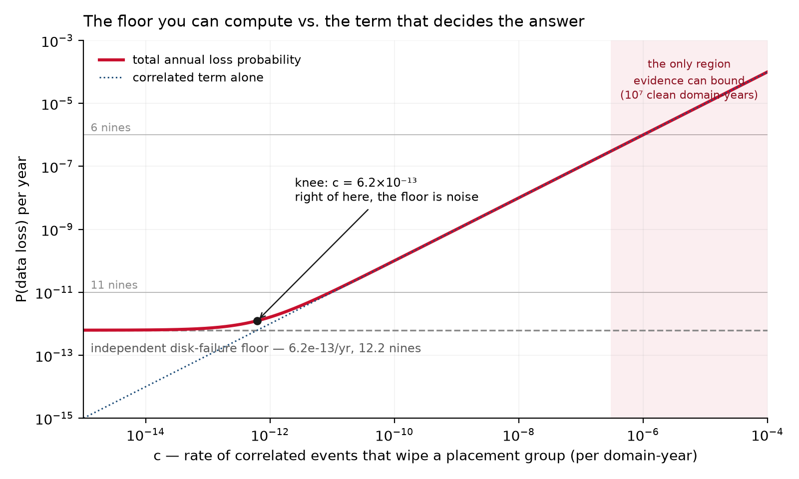

# Eleven nines, recomputed

**Issue 001** · [Designing Ultra Large Scale Systems Newsletter]({{ '/newsletter/' | relative_url }})

By [Chiradip Mandal](https://www.linkedin.com/in/chiradip/)

---

## The claim

Eleven nines of durability is a true statement about a model in which the only way to lose
data is uncorrelated disk failure. Inside that model the number is a **knob**: ordinary
parameter choices yield anything from nine nines to fourteen. Every mechanism that has
actually destroyed customer data in a published post-mortem has probability **zero** under
it. Your own evidence supports about seven.

---

## The cost

Durability is not a property of a system. It is a property of a system **and a failure
model** — and the model is where the whole number lives.

The guarantee is that your object survives the year. The price, in physics: `n` copies of
every byte (3× storage, forever) plus **reserved rebuild bandwidth** — capacity you hold
idle so that when a drive dies, its contents are re-replicated before a second one goes.
For 3-way replication the annual loss probability scales as `MTTR²`, so halving the repair
window buys 0.6 nines. That reserve is what you are actually paying for, and repair time is
the only lever the model exposes.

Now read the vendor's own wording. S3 is **"designed for"** 99.999999999% durability.
*Designed for* is carrying that sentence: it is a claim about the output of a model, not a
report of observed behaviour. Check the SLA and the asymmetry is explicit — availability
carries a credit schedule, durability carries none. The most-quoted reliability number in
our industry is the one number with no money standing behind it.

That is not an accusation of bad faith. **No provider can offer a durability SLA**, for the
reason the next section derives: nobody can accumulate enough evidence to price the risk.
The failure is on our side of the wire. We quote a modelled number as though it were a
measured one, and then we design against it.

---

## The derivation

Model a placement group of three replicas as a Markov chain on the number of survivors,
with per-drive failure rate `λ = AFR / 8766` per hour and repair rate `μ = 1/MTTR`. State 0
is absorbing — that is data loss.

```
           3λ            2λ            λ
    [3] ───────►  [2] ───────►  [1] ───────►  [0]   ← absorbing: data loss
        ◄───────      ◄───────
           μ             μ
```

Forward arrows are failures; the backward arrows are repair. State 0 has no way back —
that is the whole point of the model.

With `μ ≫ λ` the system sits in state 3 essentially always, so the loss rate is the rate of
entering state 2, times the probability of losing a second replica before repair, times the
probability of losing the third:

```
loss rate ≈ 3λ · (2λ/μ) · (λ/μ) = 6 λ³ MTTR²

  MTTDL = MTTF³ / (6 · MTTR²)          general form:  MTTF^n / (n! · MTTR^(n-1))
```

Take AFR = 2% (so MTTF ≈ 50 years ≈ 438,300 h) and a one-hour distributed rebuild:
`MTTDL ≈ 1.6 × 10¹² years`, an annual loss probability of `6.2 × 10⁻¹³` — **12.2 nines**.
The famous number is not hard to reach. It is hard to *avoid*:

| AFR | MTTR 0.5 h | 1 h | **4 h** | 10 h | 24 h |
|---|---|---|---|---|---|
| 1% | 13.7 | 13.1 | 11.9 | 11.1 | 10.4 |
| **2%** | 12.8 | 12.2 | **11.00** | 10.2 | 9.4 |
| 4% | 11.9 | 11.3 | 10.1 | 9.3 | 8.5 |

*Nines of annual durability, 3-way replication. Eleven nines is what you get from a 2% AFR
and a four-hour repair window — a wholly unremarkable choice. Pick a different MTTR and the
headline moves by three orders of magnitude.*

Now add the term the model omits. Let `c` be the annual rate of **correlated events that
take a whole placement group**: a bad firmware batch, a rack power domain, a botched deploy
of the storage path, a control-plane bug, an operator with the wrong hostname in a shell.
These are not disk failures and the chain above cannot see them.

```
P(loss)/yr  =  6.2×10⁻¹³  +  c
```

Two terms, and the first one stops mattering almost immediately. They are equal at
`c = 6.2×10⁻¹³` — the knee in the figure. Everywhere to the right of it:

| c (per domain-year) | 10⁻¹² | 10⁻¹⁰ | 10⁻⁸ | 10⁻⁶ |
|---|---|---|---|---|
| resulting nines | 11.8 | 10.0 | 8.0 | 6.0 |
| **share of the answer from disk failure** | 38% | 0.6% | 0.006% | 0.0001% |



**So how small is `c`?** It cannot be derived — only bounded by observation. If you run `N`
independent failure domains for a year and lose nothing, the rule of three gives a 95% upper
bound of `c ≤ 3/N`. The binding constraint is that the sample size is the number of
**independent failure domains**, not the number of objects: a billion objects sharing one
firmware revision and one deploy pipeline are one sample, not a billion.

| clean domain-years observed | 10⁵ | 10⁶ | 10⁷ | 10⁸ |
|---|---|---|---|---|
| **most nines you can demonstrate** | 4.5 | 5.5 | **6.5** | 7.5 |

To demonstrate `10⁻¹¹` you need **3 × 10¹¹ clean failure-domain-years**. Spread over the
twenty years object storage has existed, that is 1.5 × 10¹⁰ domains observed
concurrently — more independent failure domains than there are drives on Earth, and drives
are not independent domains. Eleven nines is not a number anyone has measured, or could.
It is unfalsifiable from the side that kills you.

---

## The engineering

If `c` is the answer, then durability engineering is **decorrelation engineering**, and most
of what we call durability work is aimed at the wrong term.

**Count independent failure domains, not replicas.** Replicas sharing a drive model,
firmware revision, power domain, storage binary, control plane, or delete path are one
domain with respect to the events in `c`. Three replicas behind one buggy delete path is
`n = 1`. The chain's `n = 3` was never a claim about copies; it was a claim about
independence, and independence is what you have to build.

**Buy down the term that dominates:**

- **Stagger** drive vendors, manufacturing batches, and firmware revisions across replicas.
  A batch defect that takes one replica of each group is the whole ballgame.
- **Stage the storage path per domain.** Deploys are correlated failure events with a
  deterministic blast radius. Yours is whatever fraction you ship at once.
- **Versioning and delayed delete.** This is the highest-leverage item on the list, because
  it converts operator and software error from *destruction* into *recovery* — moving the
  dominant contributor to `c` out of `c` entirely.
- **Scrub with an independent reader.** Checksums verified by the same code path that wrote
  them validate very little.
- **Keep a restore path with a different implementation, and exercise it.** An untested
  backup is a hypothesis, not a copy.

The two best-documented public losses are both pure `c`. GitLab's 2017 database incident
began with a directory removed on the wrong node, and their own report walks through
backup and replication procedures failing one after another. Google's 2015 lightning strikes
on the Belgian grid took out a facility's power repeatedly and cost a small quantity of
persistent-disk data permanently. Read both reports. Neither is a disk-failure story;
neither is visible anywhere in the Markov chain.

**The design consequence, stated plainly:** a fourth replica improves the term contributing
0.006% of your risk. An independent restore path improves the term that *is* your risk. If
you are choosing between them and you choose the replica, you have been sold a model.

---

## The assignment

Anchored to Vol 1, Ch 2 §2.1 (MTTF, correlated failure, Markov availability); quantitative
labs live in [`dulss-vol1-labs`](https://github.com/chiradip/dulss-vol1-labs) under `julia/`.
Answers in issue 002.

1. **Re-derive** the chain for `n = 4` and confirm `MTTDL = MTTF⁴ / (24 · MTTR³)`. State
   precisely where `μ ≫ λ` enters, and bound the error it introduces.
2. **Compute** your own floor from your real AFR and your real p99 rebuild time — not your
   target rebuild time.
3. **Solve** for the `c` at which the independent term contributes under 1% of your total.
   Compare it to the rate of storage-path deploys you shipped last quarter.
4. **Count** your organisation's genuinely independent failure domains — apply the tests in
   §4 strictly — multiply by years of clean operation, and apply the rule of three. Report
   the durability you can *demonstrate*. Most people find they are off by four nines or more.

Reproduce every number here with
[`figure.py --table`](figure.py); the script beside this issue is the whole calculation.

---

## Errata and counterexamples

Nothing to correct yet — issue 001. So we pre-register our own attack surface; the standing
offer of this letter is that **you break it and we print your name.**

Four assumptions are worth attacking: drives have bathtub hazard curves, not the constant
hazard the exponential model assumes; `μ ≫ λ` does quiet work in the approximation; `c` is
treated as one Poisson rate when correlated events plainly cluster; and the drive-population
argument is order-of-magnitude arithmetic, not a citation.

Best counterexample runs in 002, attributed. The archive is git: show that a number here is
wrong and **send the pull request** — the fix carries your name permanently.

*Next issue: what a quorum actually buys — deriving `R + W > N` from intersection, and the
three deployments where it silently stops protecting you.*

---

[← All issues]({{ '/newsletter/' | relative_url }}) · [Study group]({{ '/' | relative_url }}) · [Discord](https://discord.gg/C2aTuavXeU) · [Sessions on Luma](https://luma.com/dulss)
