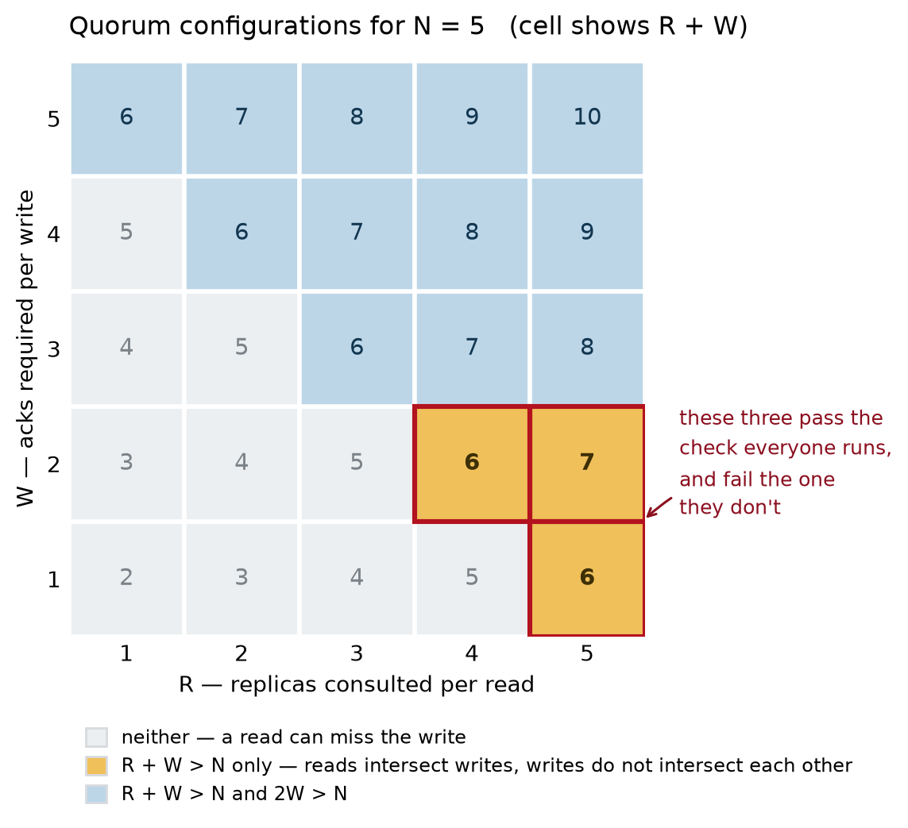

# What a quorum actually buys

**Issue 002** · [Designing Ultra Large Scale Systems Newsletter]({{ '/newsletter/' | relative_url }})

By [Chiradip Mandal](https://www.linkedin.com/in/chiradip/)

---

## The claim

`R + W > N` guarantees that a read set and a write set share at least one node. That is the
entire guarantee. It does not order writes, it does not survive a changing `N`, and it says
nothing about a write your coordinator routed somewhere else. Three ordinary configurations
satisfy the inequality and lose data anyway.

---

## The cost

The guarantee is that a read observes the latest acknowledged write. The price is round trips,
and `R` and `W` are one dial, not two: every ack you demand from the writer is one you need not
demand from the reader.

Waiting for `W` of `N` acks means your write latency is the **W-th order statistic** of `N`
samples, not an average. Take a replica that is slow on 1% of requests:

| W (of N = 3) | chance the write is slow | vs. a single replica |
|---|---|---|
| 1 | 1.0 × 10⁻⁶ | 10,000× better |
| 2 | 3.0 × 10⁻⁴ | 34× better |
| 3 | 3.0 × 10⁻² | 3× **worse** |

The middle row is why quorums are popular, and the effect is real: by not waiting for the
slowest replica you beat a single node by a factor of 34. The bottom row is the cliff. `W = N`
is not "maximum safety" — it is a system whose availability is the *product* of its replicas'
and whose latency is the worst one's. Redundancy that everyone must agree to is not redundancy.

So you pick something in the middle, check `R + W > N`, and ship. That check is where the
trouble starts — not because the inequality is wrong, but because it is the answer to a
narrower question than the one you were asking.

---

## The derivation

There are **two** intersection inequalities. Almost everyone remembers one.

Let `N` replicas hold a key. A write is acknowledged by some set 𝒲 of `W` of them; a read
consults some set ℛ of `R` of them. Neither set is chosen in advance — the client takes whoever
answers first.

**Read–write intersection.** Both sets are subsets of the same `N` nodes, so `|ℛ ∪ 𝒲| ≤ N`.
Inclusion–exclusion gives

```
|ℛ ∩ 𝒲| = |ℛ| + |𝒲| − |ℛ ∪ 𝒲| ≥ R + W − N
```

so `R + W > N` forces `|ℛ ∩ 𝒲| ≥ 1`. Every read touches at least one node that saw the write.
That is the whole theorem — pigeonhole, one line, no assumptions about timing or failure.

**Write–write intersection.** Now run the identical argument on two *write* sets:

```
|𝒲₁ ∩ 𝒲₂| ≥ 2W − N
```

which needs **`2W > N`**. Nothing in `R + W > N` implies it. They are independent conditions,
and the gap between them is where real systems live.

Take `N = 3, W = 1, R = 3`. Then `R + W = 4 > 3`: every read intersects every write, exactly as
advertised. But `2W = 2 < 3`, so two concurrent writes can be accepted by two disjoint single
nodes, each acked, neither aware of the other. The read dutifully returns both values. The
inequality held at every step and the database now has a fork.



For `N = 5` there are three such configurations — `(R,W)` of `(5,1)`, `(4,2)`, `(5,2)` — and each
one passes the check people actually run. For `N = 7` there are six.

**Now the part that bites.** You run `N = 3, W = 2, R = 2`. Both inequalities hold: `4 > 3` and
`2W = 4 > 3`. Traffic grows, so you add two replicas for read capacity — `N = 5` — and raise `R`
to 4 to keep `R + W = 6 > 5`. Every dashboard agrees the configuration is valid.

But `W` stayed at 2, and `2W = 4 < 5`. **You added replicas and lost write–write intersection.**
The cluster is less safe than it was with three nodes, and nothing in the config review says so,
because the review checks the inequality everyone knows.

---

## The engineering

**Check both inequalities, on the real `N`.** `R + W > N` *and* `2W > N`. And `N` is the number
of replicas that can acknowledge — not the number you meant. Witnesses, voting-only members and
read replicas all move it, usually without moving `W`.

**Make `W` a majority, not a number.** `W = ⌊N/2⌋ + 1` makes `2W > N` true by construction and
stays true when `N` changes. You pay with write latency tracking the median replica. That is the
price of a guarantee that does not silently expire the next time someone scales the cluster.

**A sloppy quorum is a different `N`.** Hinted handoff accepts a write on a node outside the
preference list when a member is down. The inequality is arithmetic about *one fixed set*; when
the write's set and the read's set are drawn from different universes it says nothing at all.
Cassandra's `ANY` is precisely this. It trades the guarantee for availability, which is a
legitimate trade — but it is a trade, and the config file does not use the word.

**Reconfiguration must force overlap.** Moving from `{A,B,C}` to `{C,D,E}`, a `W`-quorum in the
old configuration and an `R`-quorum in the new need not intersect. Raft's joint consensus exists
for exactly this reason; a leaderless store generally requires reads and writes through both
configurations for the duration of the move.

**Intersection is visibility, not order.** This is the one that matters. The quorum's job ends
the moment it hands your reader every value it found; deciding which is *latest* belongs to the
merge function. Last-write-wins with wall-clock timestamps decides it with a clock, so under
skew a later write loses to an earlier one and is discarded during read repair — permanently,
quietly, with every inequality satisfied. Version vectors return siblings and make you merge.
That is not the system being unhelpful; it is the system declining to lie about an order it
never had.

**The design consequence:** `R + W > N` is a *visibility* property. Every failure above is
someone reading it as a *consistency* property.

---

## The assignment

Anchored to Vol 1, Ch 2 §2.1 (quorum intersection); the quorum-store lab lives in
[`dulss-vol1-labs`](https://github.com/chiradip/dulss-vol1-labs). Answers in issue 003.

1. **Prove** `|ℛ ∩ 𝒲| ≥ R + W − N` from inclusion–exclusion, and state exactly where
   `|ℛ ∪ 𝒲| ≤ N` is used. Then say what breaks in that step under a sloppy quorum.
2. **Enumerate** every `(R,W)` for `N = 7` satisfying `R + W > N` but not `2W > N`. You should
   find six. Which of them would pass your own code review?
3. **Build** the smallest deployment that satisfies `R + W > N` and still loses an acknowledged
   write. Two nodes, two clients, one clock.
4. **Audit** your store: what is `N` really, counting witnesses and read replicas? Does `2W > N`
   hold today? Does it still hold under your documented scale-out plan?

Reproduce every number here with [`figure.py --table`](figure.py).

---

## Errata and counterexamples

No corrections to issue 001 yet; none of its four pre-registered attacks has landed. The bathtub
hazard curve is the softest of them and still unclaimed.

This issue's own surface: the latency table assumes replicas fail **independently** — the very
assumption issue 001 spent 1,400 words destroying, so those numbers are optimistic. And
"concurrent" is doing real work in the write–write argument; it wants a definition in
happens-before, not wall clock.

Show that a number here is wrong and **send the pull request** — the fix carries your name
permanently.

*Next issue: the Antithesis session, debriefed — what deterministic simulation actually proves
about a state space too large to enumerate, and the questions the room could not settle.*

---

[← All issues]({{ '/newsletter/' | relative_url }}) · [Study group]({{ '/' | relative_url }}) · [Discord](https://discord.gg/C2aTuavXeU) · [Sessions on Luma](https://luma.com/dulss)
